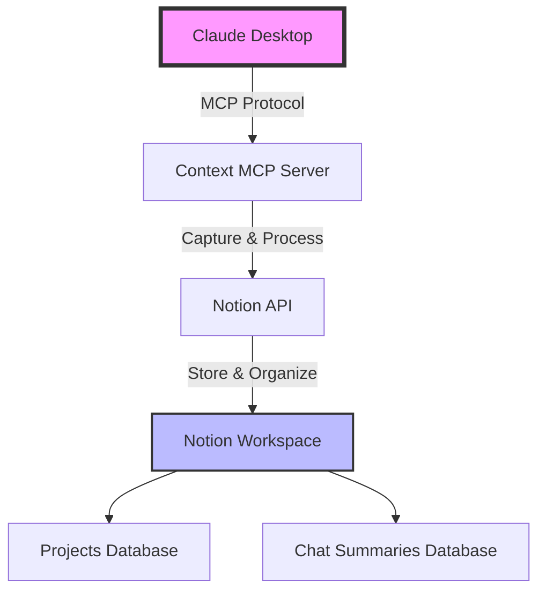
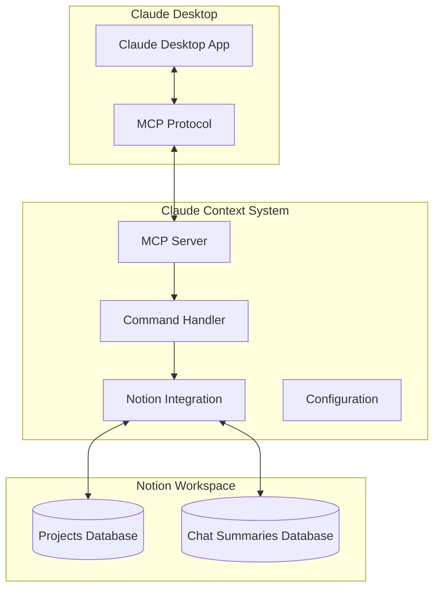

# 🔗 Claude Context System

> **Transform your AI workflow with seamless context management between Claude Desktop and Notion**

<div align="center">

[](https://opensource.org/licenses/MIT)
[](https://nodejs.org)
[](https://modelcontextprotocol.io)
[](https://github.com/yourusername/claude-context-system#-quick-start)

</div>

## 🚀 Overview

The Claude Context System is the **first-of-its-kind** integration that bridges Claude Desktop with Notion, creating a persistent memory layer for AI-assisted development. Never lose context between sessions again.

### 🎯 The Problem

- **Context Loss**: Every new Claude conversation starts from scratch
- **No Continuity**: Projects spanning multiple sessions lose critical context
- **Manual Tracking**: Developers waste time re-explaining project details
- **Knowledge Silos**: Valuable AI interactions disappear after each session

### 💡 The Solution

Claude Context System automatically:
- 📝 **Captures** every conversation with intelligent summarization
- 🔄 **Maintains** project continuity across sessions
- 🧠 **Preserves** decisions, code, and architectural choices
- 🔍 **Enables** instant context retrieval with Session IDs

## ✨ Key Features

- **🤖 Automatic Context Capture**: Every chat is intelligently summarized and stored
- **🏗️ Project-Based Organization**: Conversations linked to specific projects
- **🔗 Session Continuity**: Resume any conversation with a simple Session ID
- **📊 Rich Metadata**: Tags, priorities, participants, and decision tracking
- **🚀 One-Click Setup**: Automated installer configures everything in < 5 minutes
- **🎨 Demo Mode**: Pre-configured workspace with sample data for immediate testing

## 📸 Screenshots

<div align="center">
  
  <p><i>Notion dashboard showing project and chat organization</i></p>
</div>

## 🏗️ Architecture


## 🎯 Quick Start

```bash
# Clone the repository
git clone https://github.com/yourusername/claude-context-system.git
cd claude-context-system

# Run the automated setup
setup.bat        # Windows
./setup.sh       # Mac/Linux

# Follow the interactive prompts
```

That's it! The installer will:
- ✅ Check system requirements
- ✅ Install dependencies
- ✅ Configure Claude Desktop
- ✅ Set up Notion integration
- ✅ Create demo workspace
- ✅ Verify everything works

## 📋 Requirements

- **Node.js** 16.0 or higher
- **Claude Desktop** (latest version)
- **Notion Account** (free tier works)
- **Windows/Mac/Linux** OS

## 🛠️ Manual Installation

<details>
<summary>Click for detailed manual setup instructions</summary>

### 1. Install Dependencies

```bash
cd src/mcp-server
npm install
```

### 2. Configure Notion Integration

Create a Notion integration at https://www.notion.so/my-integrations and save your API key.

### 3. Set Up Environment Variables

```bash
cp .env.example .env
# Edit .env with your Notion API key and database IDs
```

### 4. Configure Claude Desktop

Add to your Claude Desktop config:

```json
{
  "mcpServers": {
    "claude-context": {
      "command": "node",
      "args": ["C:/path/to/claude-context-system/src/mcp-server/index.js"]
    }
  }
}
```

### 5. Import Demo Workspace

1. Download the demo template from `/demo/demo-workspace.json`
2. Import to Notion using the Notion API or web interface
3. Share the databases with your integration

</details>
## 📖 Usage

### Starting a New Project

1. **Create a Project in Notion** (or let Claude do it automatically)
2. **Start chatting in Claude Desktop** - context is captured automatically
3. **View summaries in Notion** - organized by project and date

### Continuing a Session

Simply paste a Session ID to resume:
```
Claude-20250802143000
```

Claude will immediately load all context and continue where you left off.

### Viewing Your Context

Access your Notion workspace to see:
- 📊 Project overview with all related chats
- 💬 Detailed chat summaries with key decisions
- 🏷️ Tagged and categorized conversations
- 📈 Progress tracking across sessions

## 🔧 Configuration

### Customizing Context Capture

Edit `src/mcp-server/config.json`:

```json
{
  "summarization": {
    "enabled": true,
    "maxLength": 500,
    "includeCodeBlocks": true
  },
  "notion": {
    "autoCreateProjects": true,
    "defaultTags": ["#ai-assisted", "#development"]
  }
}
```

### Advanced Features

- **Custom Taxonomies**: Define your own tags and categories
- **Webhook Integration**: Connect to other tools
- **Export Options**: Backup your context to JSON/Markdown
- **Team Sharing**: Collaborate with shared Notion workspaces
## 🏗️ Architecture

<details>
<summary>View System Architecture</summary>



</details>

For detailed architecture documentation, see [Architecture Guide](docs/ARCHITECTURE.md).

## 🤝 Contributing

We welcome contributions! Please see our [Contributing Guide](CONTRIBUTING.md) for details.

### Development Setup

```bash
# Install development dependencies
npm install --save-dev

# Run tests
npm test

# Run linter
npm run lint

# Build for production
npm run build
```

## 📊 Performance

- **Context Capture**: < 100ms per message
- **Notion Sync**: Async, non-blocking
- **Memory Usage**: < 50MB
- **Setup Time**: < 5 minutes

## 🔒 Security

- **Local Processing**: No data sent to external servers
- **Encrypted Storage**: API keys stored securely
- **Notion Permissions**: Minimal required access
- **Open Source**: Fully auditable codebase

## 🚧 Roadmap

- [ ] Multi-model support (GPT-4, Gemini)
- [ ] Local context backup
- [ ] Advanced search capabilities
- [ ] Team collaboration features
- [ ] Mobile companion app

## 📝 License

This project is licensed under the MIT License - see the [LICENSE](LICENSE) file for details.

## 🙏 Acknowledgments

- [Anthropic](https://anthropic.com) for Claude and MCP
- [Notion](https://notion.so) for the amazing API
- The open-source community for inspiration

## 📞 Support

- **Documentation**: [Full Docs](docs/README.md)
- **Issues**: [GitHub Issues](https://github.com/yourusername/claude-context-system/issues)
- **Discussions**: [GitHub Discussions](https://github.com/yourusername/claude-context-system/discussions)

---

<div align="center">
  <p>Built with ❤️ by developers, for developers</p>
  <p>⭐ Star us on GitHub!</p>
</div>