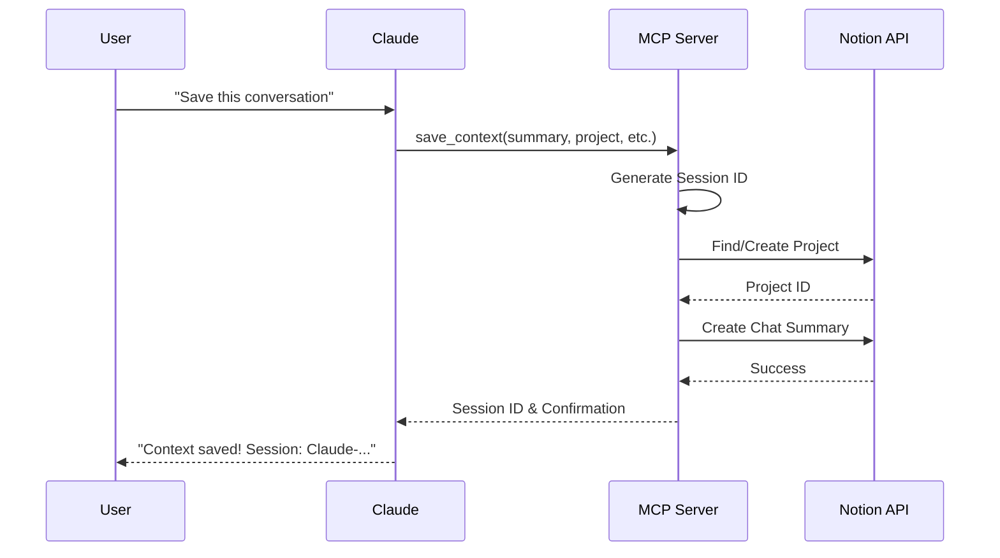
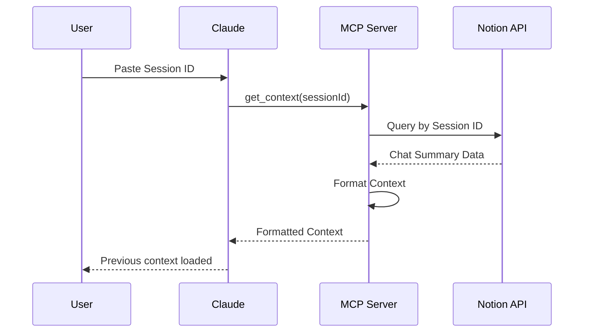

# 🏗️ Claude Context System Architecture

## Overview

The Claude Context System is built on a modern, event-driven architecture that seamlessly connects Claude Desktop with Notion through the Model Context Protocol (MCP). This document details the system components, data flow, and design decisions.

## 🎯 Design Principles

1. **Simplicity First**: Minimal configuration, maximum functionality
2. **Non-Intrusive**: Works alongside Claude without disrupting workflow
3. **Resilient**: Handles failures gracefully with proper error recovery
4. **Extensible**: Easy to add new storage backends or features
5. **Privacy-Focused**: All processing happens locally

## 🔧 System Components

### 1. MCP Server (`src/mcp-server/`)

The heart of the system - a Node.js server that implements the Model Context Protocol.

**Key Responsibilities:**
- Receives context save/retrieve requests from Claude
- Manages Notion API communication
- Handles project and chat organization
- Generates unique Session IDs

**Technologies:**
- Node.js 16+ with ES modules
- @modelcontextprotocol/sdk for MCP implementation
- @notionhq/client for Notion integration
- dotenv for configuration management

### 2. Claude Desktop Integration

Claude Desktop loads the MCP server through its configuration file:

```json
{
  "mcpServers": {
    "claude-context-system": {
      "command": "node",
      "args": ["path/to/mcp-server/index.js"]
    }
  }
}
```

**Communication Flow:**
1. User requests context save in Claude
2. Claude calls MCP tool via JSON-RPC
3. MCP server processes request
4. Response returned to Claude UI

### 3. Notion Integration

**Database Schema:**

#### Projects Database
- **Project name** (title): Unique project identifier
- **Status** (status): Not started | In progress | Done
- **Goal** (rich_text): Project description
- **Priority** (select): High | Medium | Low
- **Start/End dates** (date): Project timeline
- **Related Chats** (relation): Links to chat summaries

#### Chat Summaries Database
- **Chat Title** (title): Auto-generated descriptive title
- **Session ID** (rich_text): Unique identifier (Claude-YYYYMMDDHHMMSS)
- **Date** (date): Conversation date
- **Summary** (rich_text): AI-generated summary
- **Key Decisions** (rich_text): Important choices made
- **Next Actions** (rich_text): Identified action items
- **Project** (relation): Link to parent project
- **Tags** (multi_select): Categorization
- **Context Status** (select): Active | Continued | Complete
- **Is Most Recent** (checkbox): Latest session marker

## 📊 Data Flow

### Save Context Flow



### Retrieve Context Flow



## 🔒 Security Considerations

### API Key Management
- Notion API keys stored in `.env` file
- Never committed to version control
- Environment variables loaded at runtime

### Data Privacy
- All processing happens locally
- No third-party servers involved
- Notion data remains in user's workspace
- No analytics or telemetry

### Access Control
- Notion integration has minimal permissions
- Read/write only to specified databases
- No access to other workspace content

## ⚡ Performance Optimizations

### Asynchronous Operations
- Non-blocking Notion API calls
- Parallel project lookup and creation
- Graceful timeout handling

### Caching Strategy
- Project names cached during session
- Database IDs stored in configuration
- Minimal API calls for common operations

### Error Recovery
- Automatic retry with exponential backoff
- Graceful degradation on API failures
- Clear error messages to user

## 🔌 Extension Points

### Adding New Storage Backends
1. Implement the `StorageAdapter` interface
2. Add configuration in `config.json`
3. Update factory method in `storage/index.js`

### Custom Context Processing
- Hook into `preprocessContext()` method
- Add custom metadata extraction
- Implement specialized summarization

### Integration with Other Tools
- Webhook support for external notifications
- Export functionality for various formats
- Bulk operations API

## 🏛️ Design Decisions

### Why MCP?
- Native Claude integration
- Standardized protocol
- Future-proof architecture
- Active development by Anthropic

### Why Notion?
- Powerful relational database
- Great API with good documentation
- Free tier sufficient for most users
- Familiar UI for knowledge management

### Why Session IDs?
- Simple, memorable format
- Timezone-agnostic
- Collision-resistant
- Easy to share

## 📐 Scalability

### Current Limits
- Notion API: 3 requests/second
- MCP timeout: 30 seconds
- Max context size: 32KB

### Future Considerations
- Batch operations for bulk export
- Local caching layer
- Background sync capability
- Multi-user support

---

For implementation details, see the [API Reference](API.md).  
For usage instructions, see the [User Guide](USER_GUIDE.md).