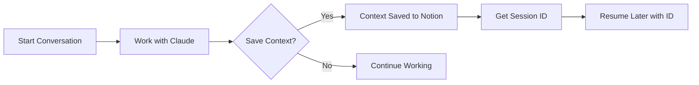

# 📖 Claude Context System User Guide

Welcome to the Claude Context System! This guide will walk you through everything you need to know to master context management in your AI-assisted development workflow.

## 🎯 Table of Contents

1. [Getting Started](#getting-started)
2. [Basic Usage](#basic-usage)
3. [Working with Projects](#working-with-projects)
4. [Advanced Features](#advanced-features)
5. [Tips & Best Practices](#tips--best-practices)
6. [Troubleshooting](#troubleshooting)

## 🚀 Getting Started

### First-Time Setup

After installation, your Claude Context System is ready to use immediately. No additional configuration needed!

### Understanding the Workflow



## 📝 Basic Usage

### Saving Your First Context

During any conversation with Claude, simply say:
- "Save this conversation"
- "Create a context checkpoint"
- "Capture this discussion"

Claude will respond with:
```
✅ Context saved successfully!

Session ID: Claude-20250802143000

Use this ID to resume this conversation later.
```

### What Gets Saved?

- **Summary**: AI-generated overview of the discussion
- **Key Decisions**: Important choices and conclusions
- **Next Actions**: Identified tasks and follow-ups
- **Code Snippets**: Any code discussed (if applicable)
- **Project Association**: Links to your project
- **Tags**: Automatic categorization

### Resuming a Conversation

To continue a previous conversation:

1. Start a new chat in Claude Desktop
2. Paste the Session ID:
   ```
   Claude-20250802143000
   ```
3. Claude loads all previous context
4. Continue where you left off!

## 🏗️ Working with Projects

### Automatic Project Creation

When you save context, Claude will:
1. Check if you mentioned a project name
2. Find existing project or create new one
3. Link the conversation automatically

### Manual Project Assignment

You can explicitly specify a project:
```
Save this to the "Mobile App Development" project
```

### Viewing Projects in Notion

Your Notion workspace contains:
- **Projects Database**: All your projects with status
- **Chat Summaries**: All conversations organized by project

<div align="center">
  
  <p><i>Projects database showing active development work</i></p>
</div>

## 🎨 Advanced Features

### Custom Tags

Add tags to organize conversations:
```
Save this with tags: #api #security #performance
```

### Priority Levels

Set priority for important discussions:
```
Save this as high priority
```

### Detailed Summaries

Request specific summary focus:
```
Save this conversation, focusing on the database design decisions
```

### Bulk Operations

List all projects:
```
Show me all my projects
```

Get project history:
```
Show me all conversations for "E-Commerce Platform"
```

## 💡 Tips & Best Practices

### 1. Regular Context Saves
- Save context at natural breakpoints
- Before switching topics or projects
- After making important decisions
- When identifying action items

### 2. Meaningful Summaries
- Let Claude auto-generate summaries
- Add specific details if needed
- Include "why" not just "what"

### 3. Project Organization
- One project per major initiative
- Use consistent naming conventions
- Archive completed projects

### 4. Tag Strategy
- Technical tags: #frontend #backend #database
- Status tags: #blocked #needs-review #urgent
- Type tags: #bug-fix #feature #refactor

### 5. Session Management
- Save Session IDs in your project docs
- Share IDs with team members
- Create "checkpoint" saves before major changes

## 🔧 Troubleshooting

### Context Not Saving?

1. Check Claude Desktop is running
2. Verify Notion API key in settings
3. Run health check: `npm run health-check`

### Can't Resume Session?

- Verify Session ID format: `Claude-YYYYMMDDHHMMSS`
- Check Notion connection
- Ensure project still exists

### Notion Sync Issues

```bash
# Test Notion connection
npm run test-notion

# Reset configuration
npm run reset-config
```

### Performance Problems

- Check Notion API limits (3 req/sec)
- Verify network connection
- Clear local cache if needed

## 🆘 Getting Help

### Error Messages

| Error | Solution |
|-------|----------|
| "No Notion API key" | Add key to `.env` file |
| "Project not found" | Check project name spelling |
| "Session timeout" | Increase timeout in config |
| "Rate limit exceeded" | Wait 1 minute and retry |

### Support Resources

- **GitHub Issues**: Report bugs and request features
- **Documentation**: Check `/docs` folder
- **Community**: Join our Discord server

## 🎯 Quick Reference

### Essential Commands

| Action | What to Say |
|--------|-------------|
| Save context | "Save this conversation" |
| Resume session | Paste Session ID |
| List projects | "Show me all projects" |
| Create project | "Create project [name]" |
| Get project chats | "Show chats for [project]" |

### Keyboard Shortcuts

- `Ctrl+S`: Quick save context (when supported)
- `Ctrl+R`: Resume last session
- `Ctrl+P`: List projects

---

Ready to become a context management pro? Start saving your conversations and never lose track of important discussions again! 🚀